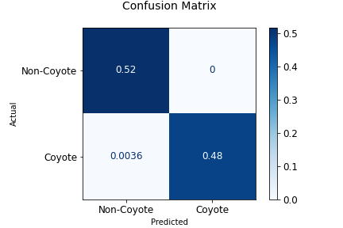
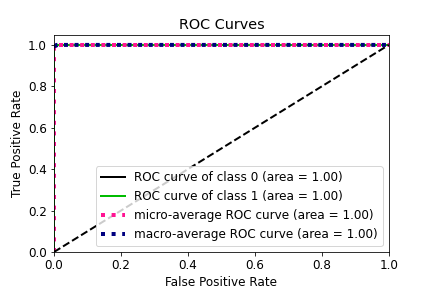

### 2022_KSW_Fall_Program

# Team Coyote2 : Deep Learning
### Project Title
        
- Comparison of Combinations of Machine Learning and Feature Extraction Methods for Coyote Howling Detection

### Project Period

- Sep/05/2022 ~ Dec/19/2022 
  
<!-- ### Contents
1. [Team](#team)
2. [Overview](#overview) 
3. [Research problem statements](#research-problem-statements)
4. [Research novelty](#research-novelty)
5. [Technology Stack](#technology-stack)
6. [Environment Setting](#environment setting)
    - [Dataset](#dataset)
    - [Requirments](#requirments)
    - [Model & Hyper Parameters](#model-&-hyper-parameters)
7. [Experiment](#Experiment)
    - [Result](#result)     -->

### Collaborator

| Name         | University               | Department                                   | Email               | Contact                        |
| :------------- | :------------------------: | :--------------------------------------------: | :-------------------: | :------------------------------: |
| Yejin Lee    | Hallym University        | Dept. of Computer Science                    | leeye0616@naver.com | https://github.com/yetniek     |
| Heesun Jung  | Hallym University        | Dept. of Computer Science                    | glee623@naver.com   | https://github.com/glee623     |
| Youngbin Kim | Kwangwoon University     | Dept. of Computer Information                | binny9904@naver.com | https://github.com/0binn       |
| BoKyung Kwon | Kwangwoon University     | Dept. of Computer Information                | bbo1209@naver.com   | https://github.com/doomdabo    |
| Jihyun Park  | Jeju National University | Dept. of Computer Science & Statistics       | mmmszip@gmail.com   | https://github.com/mmmtobezip  |
| Griffin Pegg | Purdue University        | Dept. of Computer and Information Technology | pegge@purdue.edu    | https://github.com/coyotehowls |


### Overview 


### Research problem statements 

The attacks on livestock, human, and crops by coyotes are occurring over the United States, while traditional simple management such as public
education about the method of avoiding coyotes and coyote hunting contests to reduce their numbers are executed. There are not sufficient cases of
technical approaches or research about the damage to coyotes. 

### Research novelty 
<!--수정필요-->
 The method of coyote howling sound classification using Convolutional Neural Network (CNN) to reduce the damage of coyotes is needed. 
 This paper suggests using a network connection in order to prevent the damage by informing the neighborhood farms when coyotes appear and chasing 
 coyotes through a coyote alert system. It is expected that additional technical approach to current coyote damage prevention can improve the accuracy 
 and make the previous management more practical.
    
<!-- ### Requirements
### version
`Python 3.7 ~ 3.9`

`Colab` 

`Librosa`
 -->

<!-- ### Configuration

```python
conda install -c conda-forge pyngrok  
``` -->
## Environment Setting

### File Structure
    📦2022-ksw-fall-program-fianl-team-coyote/
      └📂dataset
        └📂make_audio_dataset
          └📜audio_split.ipynb
          └📜csv_extraction.ipynb
        └📂make_image_dataset
          └📜image_extraction.ipynb
        └📂image
          └📂img_mfcc_8000
           └📜bird_1.jpg
           └...
          └📂img_mfcc_16000 
           └📜bird_1.jpg
           └...
          └📂img_melspect_8000
           └📜bird_1.jpg
           └...
          └📂img_melspect_16000
           └📜bird_1.jpg
           └...
        └📂audio
          └📜bird_1.wav
          └...
        └📜valid.csv
        └📜train.csv
        └📜test.csv
     └📂code
       └📂deep_learning
        └📜audio.ipynb
        └📜image.ipynb
       └📂machine_learning
        └📜audio.ipynb
        └📜image.ipynb
       └📂mic
        └📜mic_experiment.py
        └📜utils.py
        └📜audio_mfcc_16000_best_model_.pth 

### Dataset
 There is a total of 3,829 files in the dataset. It consists of 1,935 coyote sounds and 1,894 non-coyote sounds. 
 The non-coyote dataset has dogs, chicken, foxes and birds. The number of dogs is 503, chicken is 593, foxes is 201, and birds is 597. 
 The dataset is divided into a train, validation, and test. 
 The train data has 2,297 files, the validation data is equal to 766, and the test data has 766 files and the ratio is 6:2:2. 
 
### Model & Hyper Parameter

    The experimental setting is as follows: 
    
    ✔ OS
    - Raspberry Pi OS : Debian (64-bit)
    - Python version 3.8.10 
    - Raspberry Pi 4 Model B+ (4GB)
    ✔ Aduio
    - Optimization function : Adam optimizer
    - Learning rate : 0.001, the 
    - Batch size : 10, and the
    - Epoch : 100. 
    - Sampling rate : 16,000 (MFCC)
    ✔ Image

---
<!-- 
## Experiment


<p align="center">


<p align="center">

The loss value of the evaluation set : 0.0324

the accuracy was 279 out of 280
        
---
 -->
